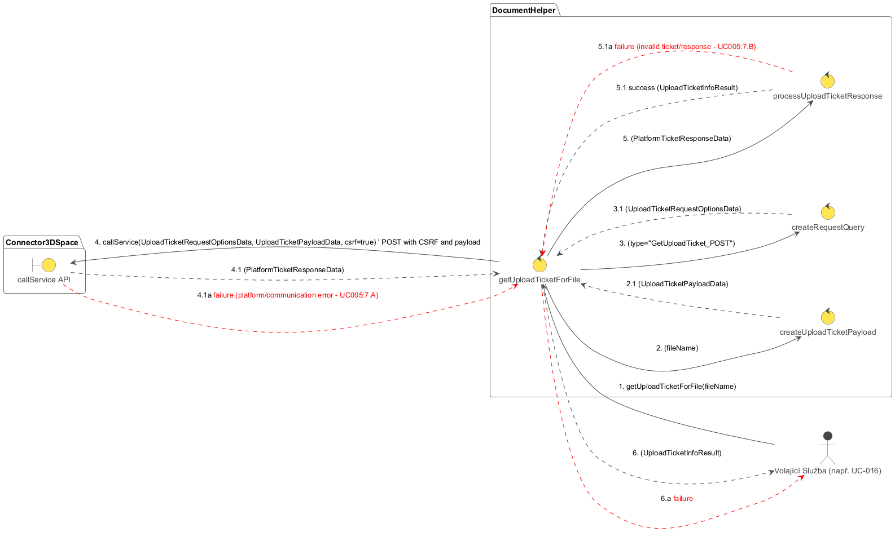

## Popis diagramu robustnosti: RD-005 Získání Upload Ticketu pro soubor

Tento diagram robustnosti (`RD-005_Get_Upload_Ticket_For_File.plantuml`) znázorňuje interakce a kontrolní tok při získávání upload ticketu pro nahrání souboru do dokumentu v 3DEXPERIENCE. Tento proces je nezbytným krokem před samotným nahráním obsahu souboru na File Collaboration Services (FCS).

**Cíl:** Získat platný upload ticket (URL, název parametru ticketu a hodnotu ticketu) od 3DEXPERIENCE platformy, který umožní následné nahrání souboru na FCS.

**Hlavní aktéři a moduly:**

*   **Volající (Caller):** Komponenta, která potřebuje nahrát soubor (např. `DocumentHelper` v rámci operace `uploadFileToDocument`).
*   **DocumentHelper:** Modul poskytující služby pro interakci s dokumenty.
    *   `getUploadTicketForFile` (UC-005): Hlavní metoda pro získání upload ticketu.
*   **Connector3DSpace:** Komponenta zodpovědná za komunikaci s 3DEXPERIENCE platformou.

**Sekvence kroků a možné chyby:**

1.  **Iniciace (`Volající` -> `getUploadTicketForFile`):**
    *   `Volající` zavolá metodu `getUploadTicketForFile` v modulu `DocumentHelper` s parametrem `docId` (ID dokumentu, do kterého se bude soubor nahrávat) a případně dalšími parametry jako `fileName` (pokud API pro ticket vyžaduje metadata souboru).

2.  **Příprava a volání API (`getUploadTicketForFile` -> `Connector3DSpace`):**
    *   Metoda `getUploadTicketForFile` připraví potřebný API požadavek (např. `PUT /resources/v1/modeler/documents/{docId}/files/CheckinTicket`). Požadavek typu PUT často vyžaduje CSRF token. Může také obsahovat tělo s metadaty souboru, pokud to API vyžaduje.
    *   Zavolá službu `Connector3DSpace.callService` s připraveným požadavkem a indikací, že je potřeba CSRF token.
    *   **Úspěch (2.1):** `Connector3DSpace` úspěšně provede volání a vrátí odpověď od serveru (`rawApiResponse`).
    *   **Chyba (2.1a):** Během volání API došlo k chybě (síťový problém, chyba serveru 5xx, neautorizovaný přístup 401, problém s CSRF tokenem 403). Proces končí chybou.

3.  **Zpracování odpovědi API (`getUploadTicketForFile`):**
    *   Metoda `getUploadTicketForFile` zpracuje `rawApiResponse`.
    *   Ověří, zda odpověď má očekávanou strukturu a zda obsahuje platné informace o upload ticketu (např. `ticketURL`, `ticketparamname`, `ticket`).
    *   Extrahuje tyto informace.
    *   **Úspěch (3.1):** Odpověď je validní, informace o upload ticketu (`uploadTicketInfo`) jsou extrahovány.
    *   **Chyba (3.1a):** Odpověď API je nevalidní, má neočekávanou strukturu nebo neobsahuje potřebné informace o ticketu, i když HTTP status byl úspěšný. Proces končí chybou.

4.  **Vrácení výsledku (`getUploadTicketForFile` -> `Volající`):**
    *   **Úspěch (4):** Pokud získání ticketu proběhlo úspěšně, `getUploadTicketForFile` vrátí `uploadTicketInfo` (objekt obsahující URL a parametry ticketu) `Volajícímu`.
    *   **Chyba (4a):** Pokud v krocích 2 nebo 3 došlo k chybě, `getUploadTicketForFile` vyvolá nebo propaguje chybu `Volajícímu`.

**Shrnutí funkce diagramu:**

Diagram `RD-005_Get_Upload_Ticket_For_File.plantuml` popisuje proces získání autorizace (ve formě upload ticketu) pro nahrání souboru na FCS. Ukazuje interakci s API platformy pro vygenerování tohoto ticketu. Robustnost je zajištěna ošetřením chyb při volání API (včetně potenciálních problémů s CSRF) a při parsování odpovědi. Výstupem jsou informace potřebné k následnému kontaktování FCS pro samotné nahrání souboru.
