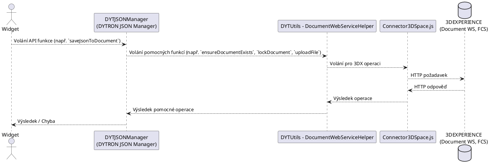

# Souhrn Analýzy Systému: DYTRON JSON Manager

**Datum Vytvoření:** 2025-05-12
**Verze:** 1.1

## 1. Úvod

### 1.1. Účel dokumentu
Tento dokument poskytuje souhrnný přehled analýzy a návrhu utility `DYTRON JSON Manager` (zkr. `DYTJSONManager`). Cílem je konsolidovat klíčové informace z jednotlivých fází návrhového procesu, včetně požadavků, architektury, případů užití a návrhu tříd. Dokument zahrnuje také vizuální diagramy pro lepší srozumitelnost.

### 1.2. Přehled analyzovaného systému
Analyzovaný systém, `DYTRON JSON Manager` (zkr. `DYTJSONManager`), je utilita určená pro zjednodušení práce s "Document" objekty a jejich souborovými přílohami (primárně JSON) v prostředí 3DEXPERIENCE. Poskytuje vysokoúrovňové API pro widgety.

Podrobný popis systému je k dispozici v hlavním návrhovém dokumentu:
- `\\3dexpprod\webapps\DYTUtils\webapps\DYTUtils\Docs\navrh_systemu.md`

Návrh pomocné utility `DYTUtils - DocumentWebServiceHelper` je popsán zde:
- `\\3dexpprod\webapps\DYTUtils\webapps\DYTUtils\Docs\navrh_document_webservice_helper.md`

## 2. Požadavky

### 2.1. Funkční požadavky (FR)
Klíčové funkční požadavky (`FR-001` až `FR-007`) zahrnují operace jako zajištění existence dokumentu, nahrání/stažení souboru, zamčení/odemčení dokumentu, smazání souboru a vyhledání dokumentu.

Detailní reference:
- Implicitně definovány a revidovány v rámci diskuse a návrhu `DYTUtils - DocumentWebServiceHelper`.

### 2.2. Nefunkční požadavky (NFR)
Hlavní nefunkční požadavky jsou:
- **NFR-001:** Veškerá komunikace přes `Connector3DSpace.js`.
- **NFR-002:** Implementace jako RequireJS modul.
- **NFR-003:** Práce s JSON daty.

Tyto požadavky jsou zohledněny v celkovém návrhu systému (viz `\\3dexpprod\webapps\DYTUtils\webapps\DYTUtils\Docs\navrh_systemu.md`, sekce 7).

## 3. Návrh Systému

### 3.1. Celková Architektura
Architektura je založena na dvou hlavních komponentách v rámci `DYTUtils`:
1.  `DYTRON JSON Manager` (Orchestrator, poskytující API pro widgety, implementován třídou `JsonManagerController`).
2.  `DYTUtils - DocumentWebServiceHelper` (Helper, zapouzdřující nízkoúrovňové interakce s 3DEXPERIENCE).

Obě komponenty využívají existující `Connector3DSpace.js`.

Architektonický diagram (z `\\3dexpprod\webapps\DYTUtils\webapps\DYTUtils\Docs\navrh_systemu.md`):

*Poznámka: Pro zobrazení tohoto diagramu jako obrázku by bylo potřeba jej vygenerovat a vložit.*

### 3.2. API Rozhraní (DYTRON JSON Manager)
- `loadJsonFromDocument(documentTitle: string, fileName: string): Promise<DownloadedJson>`
- `saveJsonToDocument(documentTitle: string, fileName: string, jsonData: object | string): Promise<FileInfo>`

Detaily viz `\\3dexpprod\webapps\DYTUtils\webapps\DYTUtils\Docs\navrh_systemu.md`, sekce 3.

## 4. Případy Užití (Use Cases)

### 4.1. UC-001: Načtení JSON dat z dokumentu
**Popis scénáře:** Viz `\\3dexpprod\webapps\DYTUtils\webapps\DYTUtils\Docs\navrh_systemu.md`, sekce 5.1.

**Robustness Diagram:**
@import "e:\3DS Hosts\3DEXPPROD\3dcas\DYTUtils\Docs\04-robustness\RD-001_Load_JSON_Data.plantuml"
**Sekvenční Diagram:**
@import "e:\3DS Hosts\3DEXPPROD\3dcas\DYTUtils\Docs\05-sequence\SD-001_Load_JSON_Data.plantuml"
### 4.2. UC-002: Uložení JSON dat do dokumentu
**Popis scénáře:** Viz `\\3dexpprod\webapps\DYTUtils\webapps\DYTUtils\Docs\navrh_systemu.md`, sekce 5.2.

**Robustness Diagram:**
@import "e:\3DS Hosts\3DEXPPROD\3dcas\DYTUtils\Docs\04-robustness\RD-002_Save_JSON_Data.plantuml"

**Sekvenční Diagram:**
!Sekvnční Diagram: UC-002 Uložení JSON dat
@import "e:\3DS Hosts\3DEXPPROD\3dcas\DYTUtils\Docs\05-sequence\SD-002_Save_JSON_Data.plantuml"
## 5. Návrh Tříd

**Diagram Tříd:**
!Diagrm Tříd: Klíčové třídy
@import "e:\3DS Hosts\3DEXPPROD\3dcas\DYTUtils\Docs\06-classes\CD-001_Core_Classes.plantuml"
**Popis klíčových tříd:**
-   **`JsonManagerController` (Orchestrator v rámci `DYTRON JSON Manager`):** Poskytuje vysokoúrovňové API `loadJsonFromDocument` a `saveJsonToDocument`. Orchestruje volání na `DocHelperCtrl`. Obsahuje referenci na `DocHelperCtrl`.
-   **`DocHelperCtrl` (Helper):** Zapouzdřuje nízkoúrovňové operace s dokumenty a soubory (např. `ensureDocumentExists`, `lockDocument`, `uploadFileToDocument`). Využívá `Connector3DSpace.js`. Obsahuje referenci na `Connector3DSpace`.
-   **Datové struktury (`DocumentInfo`, `FileInfo`, `DownloadedJson`):** Reprezentují data přenášená mezi vrstvami a vrácená klientovi.

## 6. Závěr
Tento dokument shrnuje klíčové aspekty analýzy a návrhu utility `DYTRON JSON Manager`. Návrh je považován za konzistentní napříč všemi artefakty (scénáře, robustness diagramy, sekvenční diagramy, diagram tříd) a zohledňuje definované funkční i nefunkční požadavky.

Další kroky by mohly zahrnovat detailnější specifikaci datových struktur nebo přípravu na implementaci.

---
*Poznámka: Tento dokument využívá direktivu @import pro vkládání PlantUML diagramů, což vyžaduje Markdown previewer s podporou této funkce (např. Markdown Preview Enhanced).*