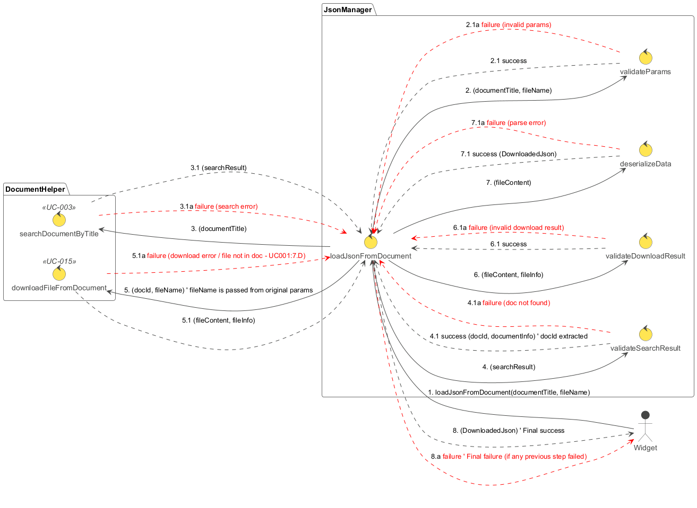

## Popis diagramu robustnosti: RD-001 Načtení JSON dat

Tento diagram robustnosti (`RD-001_Load_JSON_Data.plantuml`) znázorňuje interakce a kontrolní tok při načítání JSON dat z dokumentu uloženého v 3DEXPERIENCE. Proces je iniciován `Widgetem` a orchestrován modulem `JsonManager`, který využívá služby modulu `DocumentHelper`.

**Cíl:** Načíst obsah souboru (předpokládá se JSON) z konkrétního dokumentu, deserializovat ho a vrátit jako strukturovaná data.

**Hlavní aktéři a moduly:**

*   **Widget:** Představuje uživatelské rozhraní nebo jinou komponentu, která spouští proces načítání.
*   **JsonManager:** Hlavní řídící modul, který obsahuje logiku pro orchestraci celého procesu.
    *   `loadJsonFromDocument`: Hlavní řídící metoda.
    *   `validateParams`: Kontroluje vstupní parametry.
    *   `validateSearchResult`: Kontroluje výsledek vyhledávání dokumentu.
    *   `validateDownloadResult`: Kontroluje výsledek stažení souboru.
    *   `deserializeData`: Převede stažený textový obsah na JSON objekt.
*   **DocumentHelper:** Modul poskytující služby pro interakci s dokumenty v 3DEXPERIENCE.
    *   `searchDocumentByTitle` (UC-003): Vyhledá dokument podle názvu.
    *   `downloadFileFromDocument` (UC-015): Stáhne soubor z dokumentu.

**Sekvence kroků a možné chyby:**

1.  **Iniciace (`Widget` -> `loadJsonFromDocument`):**
    *   `Widget` zavolá metodu `loadJsonFromDocument` v modulu `JsonManager` s parametry `documentTitle` (název dokumentu) a `fileName` (název souboru v dokumentu).

2.  **Validace parametrů (`loadJsonFromDocument` -> `validateParams`):**
    *   `loadJsonFromDocument` předá přijaté parametry metodě `validateParams` k ověření.
    *   **Úspěch (2.1):** Parametry jsou validní.
    *   **Chyba (2.1a):** Parametry jsou nevalidní (např. chybějící název dokumentu). Proces končí chybou.

3.  **Vyhledání dokumentu (`loadJsonFromDocument` -> `searchDocumentByTitle`):**
    *   Pokud byly parametry validní, `loadJsonFromDocument` zavolá metodu `searchDocumentByTitle` (UC-003) z modulu `DocumentHelper` s parametrem `documentTitle`.
    *   **Úspěch (3.1):** `searchDocumentByTitle` vrátí `searchResult` (informace o nalezeném dokumentu, včetně jeho ID).
    *   **Chyba (3.1a):** Během vyhledávání došlo k chybě (např. problém s API, nedostatečná oprávnění). Proces končí chybou.

4.  **Validace výsledku vyhledávání (`loadJsonFromDocument` -> `validateSearchResult`):**
    *   `loadJsonFromDocument` předá `searchResult` metodě `validateSearchResult`.
    *   **Úspěch (4.1):** Dokument byl nalezen a z `searchResult` je extrahováno `docId` a další `documentInfo`.
    *   **Chyba (4.1a):** Dokument nebyl nalezen nebo výsledek vyhledávání je nevalidní. Proces končí chybou.

5.  **Stažení souboru (`loadJsonFromDocument` -> `completeFileDownload`):**
    *   Pokud byl dokument úspěšně nalezen, `loadJsonFromDocument` zavolá metodu `completeFileDownload` (UC-015) z modulu `DocumentHelper` s parametry `docId` (získané v kroku 4) a `fileName` (původní parametr).
    *   **Úspěch (5.1):** `completeFileDownload` vrátí `fileContent` (obsah souboru) a `fileInfo` (metadata souboru).
    *   **Chyba (5.1a):** Během stahování došlo k chybě (např. problém s API pro download ticket, soubor neexistuje v dokumentu, chyba FCS). Proces končí chybou.

6.  **Validace výsledku stažení (`loadJsonFromDocument` -> `validateDownloadResult`):**
    *   `loadJsonFromDocument` předá `fileContent` a `fileInfo` metodě `validateDownloadResult`.
    *   **Úspěch (6.1):** Stažený obsah a informace o souboru jsou validní.
    *   **Chyba (6.1a):** Výsledek stažení je nevalidní (např. prázdný obsah, pokud se očekával neprázdný). Proces končí chybou.

7.  **Deserializace dat (`loadJsonFromDocument` -> `deserializeData`):**
    *   `loadJsonFromDocument` předá `fileContent` metodě `deserializeData`.
    *   **Úspěch (7.1):** `fileContent` je úspěšně převeden na JSON objekt (`DownloadedJson`).
    *   **Chyba (7.1a):** Obsah souboru není validní JSON a nelze ho deserializovat. Proces končí chybou.

8.  **Vrácení výsledku (`loadJsonFromDocument` -> `Widget`):**
    *   **Úspěch (8):** Pokud všechny předchozí kroky proběhly úspěšně, `loadJsonFromDocument` vrátí `Widgetu` deserializovaná JSON data (`DownloadedJson`).
    *   **Chyba (8a):** Pokud kterýkoli z předchozích kroků selhal, `loadJsonFromDocument` vrátí `Widgetu` informaci o chybě.

**Shrnutí funkce diagramu:**

Diagram `RD-001_Load_JSON_Data.plantuml` detailně popisuje robustní proces načítání a zpracování JSON dat z dokumentu. Klade důraz na validaci v každém klíčovém kroku (parametry, výsledek vyhledávání, výsledek stahování) a na správné ošetření chybových stavů. Orchestrace pomocí `JsonManageru` zajišťuje, že jednotlivé operace (vyhledání, stažení, deserializace) jsou volány ve správném pořadí a jejich výsledky jsou řádně zpracovány.
