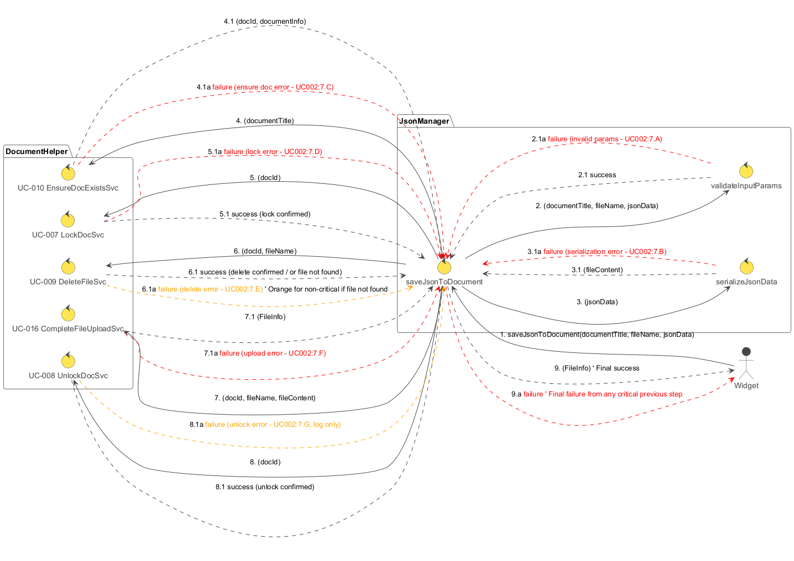

## Popis diagramu robustnosti: RD-002 Uložení JSON dat

Tento diagram robustnosti (`RD-002_Save_JSON_Data.plantuml`) znázorňuje interakce a kontrolní tok při ukládání JSON dat do souboru v existujícím dokumentu v 3DEXPERIENCE. Proces je iniciován `Widgetem` a orchestrován modulem `JsonManager`, který využívá služby modulu `DocumentHelper`.

**Cíl:** Serializovat poskytnutá JSON data, nahrát je jako soubor do specifikovaného dokumentu (případně přepsat existující soubor) a zajistit konzistenci operace pomocí zamykání a odemykání dokumentu.

**Hlavní aktéři a moduly:**

*   **Widget:** Představuje uživatelské rozhraní nebo jinou komponentu, která spouští proces ukládání.
*   **JsonManager:** Hlavní řídící modul pro orchestraci ukládání.
    *   `saveJsonToDocument`: Hlavní řídící metoda.
    *   `validateParams`: Kontroluje vstupní parametry (název dokumentu, název souboru, JSON data).
    *   `serializeData`: Převede JSON objekt na textový řetězec.
    *   `validateSearchResult`: Kontroluje výsledek vyhledávání dokumentu.
    *   `processSaveOperation`: Zapouzdřuje logiku zamykání, mazání, nahrávání a odemykání.
*   **DocumentHelper:** Modul poskytující služby pro interakci s dokumenty.
    *   `searchDocumentByTitle` (UC-003): Vyhledá dokument podle názvu.
    *   `reserveDocument` (UC-007): Zamkne dokument pro exkluzivní úpravy.
    *   `deleteFileFromDocument` (UC-009): Smaže soubor z dokumentu (pokud je potřeba přepsat).
    *   `uploadFileToDocument` (UC-016): Nahraje obsah souboru do dokumentu (zahrnuje získání upload ticketu, nahrání na FCS a připojení k dokumentu).
    *   `unreserveDocument` (UC-008): Odemkne dokument.

**Sekvence kroků a možné chyby:**

1.  **Iniciace (`Widget` -> `saveJsonToDocument`):**
    *   `Widget` zavolá metodu `saveJsonToDocument` v `JsonManageru` s parametry `documentTitle`, `fileName` a `jsonData`.

2.  **Validace parametrů (`saveJsonToDocument` -> `validateParams`):**
    *   Ověření vstupních parametrů.
    *   **Úspěch (2.1):** Parametry jsou validní.
    *   **Chyba (2.1a):** Nevalidní parametry. Proces končí chybou.

3.  **Serializace dat (`saveJsonToDocument` -> `serializeData`):**
    *   `jsonData` jsou převedena na textový řetězec `fileContent`.
    *   **Úspěch (3.1):** Data úspěšně serializována.
    *   **Chyba (3.1a):** Chyba při serializaci. Proces končí chybou.

4.  **Vyhledání dokumentu (`saveJsonToDocument` -> `searchDocumentByTitle`):**
    *   Vyhledání cílového dokumentu pomocí `DocumentHelper.searchDocumentByTitle`.
    *   **Úspěch (4.1):** `searchResult` obsahuje informace o dokumentu.
    *   **Chyba (4.1a):** Chyba při vyhledávání. Proces končí chybou.

5.  **Validace výsledku vyhledávání (`saveJsonToDocument` -> `validateSearchResult`):**
    *   Ověření, zda byl dokument nalezen; extrakce `docId`.
    *   **Úspěch (5.1):** Dokument nalezen, `docId` získáno.
    *   **Chyba (5.1a):** Dokument nenalezen. Proces končí chybou.

6.  **Zpracování operace uložení (`saveJsonToDocument` -> `processSaveOperation`):**
    Tento krok zapouzdřuje transakční část operace:
    *   **6.1 Zamčení dokumentu (`processSaveOperation` -> `reserveDocument` UC-007):**
        *   Dokument je zamčen pomocí `DocumentHelper.reserveDocument(docId)`.
        *   **Úspěch (6.1.1):** Dokument úspěšně zamčen.
        *   **Chyba (6.1.1a):** Chyba při zamykání. `processSaveOperation` se pokusí dokument odemknout (pokud byl zamčen jiným procesem v rámci této operace) a proces končí chybou.
    *   **6.2 (Volitelně) Smazání existujícího souboru (`processSaveOperation` -> `deleteFileFromDocument` UC-009):**
        *   Pokud je `overwriteIfExists` nastaveno na true a soubor již existuje, je smazán pomocí `DocumentHelper.deleteFileFromDocument(docId, fileName)`.
        *   **Úspěch (6.2.1):** Soubor smazán nebo nebyl k mazání.
        *   **Chyba (6.2.1a):** Chyba při mazání. `processSaveOperation` se pokusí dokument odemknout a proces končí chybou.
    *   **6.3 Nahrání souboru (`processSaveOperation` -> `uploadFileToDocument` UC-016):**
        *   Nový obsah `fileContent` je nahrán pod názvem `fileName` do dokumentu `docId` pomocí `DocumentHelper.uploadFileToDocument`.
        *   **Úspěch (6.3.1):** Soubor úspěšně nahrán.
        *   **Chyba (6.3.1a):** Chyba při nahrávání. `processSaveOperation` se pokusí dokument odemknout a proces končí chybou.
    *   **6.4 Odemčení dokumentu (`processSaveOperation` -> `unreserveDocument` UC-008):**
        *   Dokument je odemčen pomocí `DocumentHelper.unreserveDocument(docId)`. Tento krok se provede vždy (i v případě chyby v krocích 6.2, 6.3, pokud byl dokument úspěšně zamčen v 6.1), aby se zajistilo uvolnění zámku.
        *   **Úspěch (6.4.1):** Dokument úspěšně odemčen.
        *   **Chyba (6.4.1a):** Chyba při odemykání (loguje se, ale hlavní výsledek operace závisí na předchozích krocích).

7.  **Vrácení výsledku (`saveJsonToDocument` -> `Widget`):**
    *   **Úspěch (7):** Pokud všechny kroky v `processSaveOperation` proběhly úspěšně, `saveJsonToDocument` vrátí `Widgetu` potvrzení o úspěšném uložení.
    *   **Chyba (7a):** Pokud některý z kroků selhal, vrátí se informace o chybě.

**Shrnutí funkce diagramu:**

Diagram `RD-002_Save_JSON_Data.plantuml` popisuje robustní proces pro uložení JSON dat do dokumentu. Zahrnuje validaci, serializaci, vyhledání dokumentu a klíčovou sekvenci operací (zamknout, smazat, nahrát, odemknout) pro zajištění integrity dat. Důraz je kladen na správné ošetření chyb a zajištění, že dokument nezůstane zbytečně zamčený.
