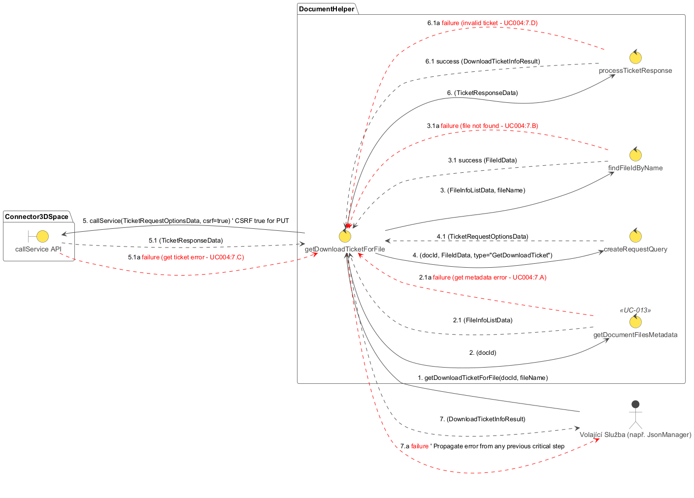

## Popis diagramu robustnosti: RD-004 Získání Download Ticketu pro soubor

Tento diagram robustnosti (`RD-004_Get_Download_Ticket_For_File.plantuml`) znázorňuje interakce a kontrolní tok při získávání download ticketu pro konkrétní soubor v dokumentu v 3DEXPERIENCE. Tento proces je nezbytným krokem před samotným stažením obsahu souboru z File Collaboration Services (FCS).

**Cíl:** Získat platný download ticket (URL a další parametry) od 3DEXPERIENCE platformy, který umožní následné stažení souboru.

**Hlavní aktéři a moduly:**

*   **Volající (Caller):** Komponenta, která potřebuje stáhnout soubor (např. `DocumentHelper` v rámci operace `completeFileDownload`).
*   **DocumentHelper:** Modul poskytující služby pro interakci s dokumenty.
    *   `getDownloadTicketForFile` (UC-004): Hlavní metoda pro získání download ticketu.
*   **Connector3DSpace:** Komponenta zodpovědná za komunikaci s 3DEXPERIENCE platformou.

**Sekvence kroků a možné chyby:**

1.  **Iniciace (`Volající` -> `getDownloadTicketForFile`):**
    *   `Volající` zavolá metodu `getDownloadTicketForFile` v modulu `DocumentHelper` s parametry `docId` (ID dokumentu) a `fileId` (ID souboru v dokumentu).

2.  **Příprava a volání API (`getDownloadTicketForFile` -> `Connector3DSpace`):**
    *   Metoda `getDownloadTicketForFile` připraví potřebný API požadavek (např. `PUT /resources/v1/modeler/documents/{docId}/files/{fileId}/DownloadTicket`). Požadavek typu PUT často vyžaduje CSRF token.
    *   Zavolá službu `Connector3DSpace.callService` s připraveným požadavkem a indikací, že je potřeba CSRF token.
    *   **Úspěch (2.1):** `Connector3DSpace` úspěšně provede volání a vrátí odpověď od serveru (`rawApiResponse`).
    *   **Chyba (2.1a):** Během volání API došlo k chybě (síťový problém, chyba serveru 5xx, neautorizovaný přístup 401, problém s CSRF tokenem 403). Proces končí chybou.

3.  **Zpracování odpovědi API (`getDownloadTicketForFile`):**
    *   Metoda `getDownloadTicketForFile` zpracuje `rawApiResponse`.
    *   Ověří, zda odpověď má očekávanou strukturu a zda obsahuje platné informace o download ticketu (např. `ticketURL`, `fileName`).
    *   Extrahuje tyto informace.
    *   **Úspěch (3.1):** Odpověď je validní, informace o download ticketu (`downloadTicketInfo`) jsou extrahovány.
    *   **Chyba (3.1a):** Odpověď API je nevalidní, má neočekávanou strukturu nebo neobsahuje potřebné informace o ticketu, i když HTTP status byl úspěšný. Proces končí chybou.

4.  **Vrácení výsledku (`getDownloadTicketForFile` -> `Volající`):**
    *   **Úspěch (4):** Pokud získání ticketu proběhlo úspěšně, `getDownloadTicketForFile` vrátí `downloadTicketInfo` (objekt obsahující URL a další parametry ticketu) `Volajícímu`.
    *   **Chyba (4a):** Pokud v krocích 2 nebo 3 došlo k chybě, `getDownloadTicketForFile` vyvolá nebo propaguje chybu `Volajícímu`.

**Shrnutí funkce diagramu:**

Diagram `RD-004_Get_Download_Ticket_For_File.plantuml` popisuje proces získání autorizace (ve formě download ticketu) pro stažení souboru. Ukazuje interakci s API platformy pro vygenerování tohoto ticketu. Robustnost je zajištěna ošetřením chyb při volání API (včetně potenciálních problémů s CSRF) a při parsování odpovědi. Výstupem jsou informace potřebné k následnému kontaktování FCS pro samotné stažení souboru.
