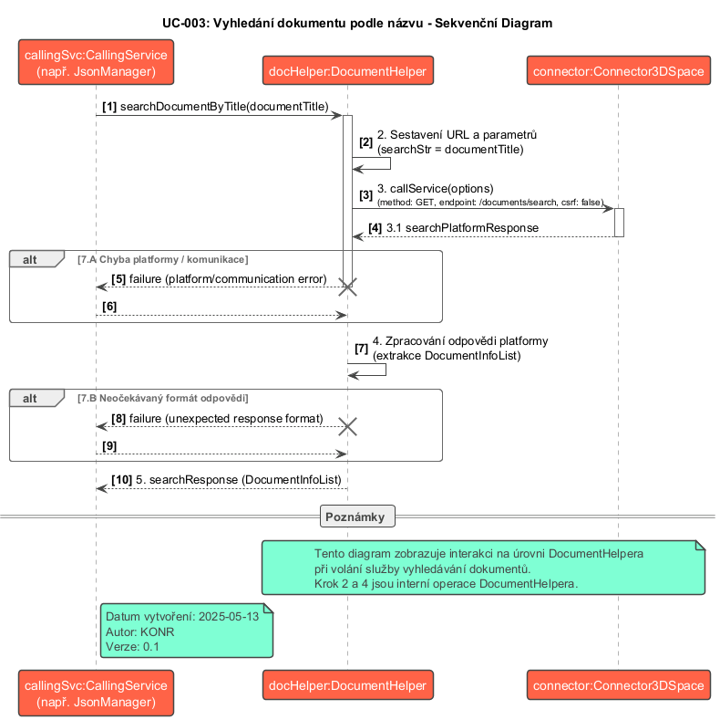

## Popis sekvenčního diagramu: SD-003 Vyhledání dokumentu podle názvu

Tento sekvenční diagram (`SD-003_Search_Document_By_Title.puml`) znázorňuje časovou posloupnost zpráv (volání metod a odpovědí) mezi jednotlivými účastníky při vyhledávání dokumentu v 3DEXPERIENCE na základě jeho názvu.

**Cíl:** Ukázat tok komunikace od iniciace vyhledávání až po získání výsledků vyhledávání dokumentů.

**Účastníci:**

*   **Caller:** Reprezentuje komponentu, která spouští operaci vyhledávání (např. `JsonManager` nebo přímo `Widget`).
*   **DocumentHelper:** Modul zodpovědný za implementaci logiky pro práci s Document API.
*   **Connector3DSpace:** Modul zodpovědný za volání REST API na 3DEXPERIENCE platformě.
*   **Server:** Reprezentuje backend 3DEXPERIENCE platformy, který zpracovává API požadavky.

**Sekvence zpráv:**

1.  **`searchDocumentByTitle(documentTitle)`:** `Caller` odešle zprávu (zavolá metodu) `searchDocumentByTitle` na objektu `DocumentHelper`, předávající název dokumentu k vyhledání (`documentTitle`).
2.  **`callService(options)`:** `DocumentHelper` připraví parametry (`options`) pro volání API (URL endpointu `/resources/v1/modeler/documents/search` s query parametrem `searchStr`) a odešle zprávu `callService` na objektu `Connector3DSpace`.
3.  **`HTTP GET /resources/v1/modeler/documents/search?searchStr=...`:** `Connector3DSpace` odešle HTTP GET požadavek na `Server`.
4.  **`HTTP Response (200 OK)`:** `Server` zpracuje požadavek, provede vyhledávání a odešle zpět HTTP odpověď s výsledky (pole dokumentových "stubů").
5.  **`response`:** `Connector3DSpace` přijme HTTP odpověď a předá ji jako zprávu (`response`) zpět objektu `DocumentHelper`.
6.  **`searchResult`:** `DocumentHelper` zpracuje přijatou odpověď, extrahuje výsledky vyhledávání (`searchResult`) a vrátí je jako odpověď na původní volání `searchDocumentByTitle` zpět `Callerovi`.

**Možné alternativní toky (ne vždy zobrazeny v základním sekvenčním diagramu):**

*   Pokud dojde k chybě při volání API (krok 3), `Server` vrátí chybovou HTTP odpověď (např. 400, 401, 403, 500). `Connector3DSpace` předá tuto chybu zpět `DocumentHelperu` (krok 5), který ji následně propaguje `Callerovi` (krok 6).
*   Pokud `Server` vrátí úspěšnou odpověď (200 OK), ale nenajde žádné dokumenty, `searchResult` (krok 6) bude prázdné pole.

**Shrnutí funkce diagramu:**

Sekvenční diagram `SD-003_Search_Document_By_Title.puml` vizualizuje jednoduchý, ale základní tok komunikace pro vyhledání dokumentu podle názvu. Jasně ukazuje, jak `DocumentHelper` funguje jako prostředník mezi volající logikou a `Connector3DSpace`, který se stará o samotnou komunikaci se serverem 3DEXPERIENCE platformy.