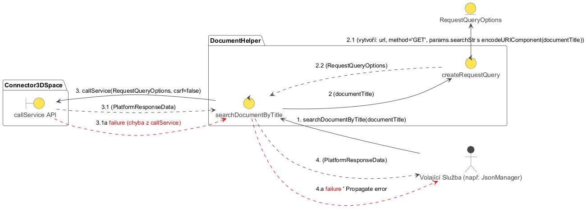

## Popis diagramu robustnosti: RD-003 Vyhledání dokumentu podle názvu

Tento diagram robustnosti (`RD-003_Search_Document_By_Title.plantuml`) znázorňuje interakce a kontrolní tok při vyhledávání dokumentu v 3DEXPERIENCE na základě jeho názvu. Tento proces je typicky součástí komplexnějších operací, jako je načítání nebo ukládání dat do dokumentu.

**Cíl:** Najít dokument(y) odpovídající zadanému názvu a vrátit základní informace o nich (minimálně ID dokumentu).

**Hlavní aktéři a moduly:**

*   **Volající (Caller):** Může to být `JsonManager`, `Widget` nebo jakákoli jiná komponenta, která potřebuje vyhledat dokument.
*   **DocumentHelper:** Modul poskytující služby pro interakci s dokumenty.
    *   `searchDocumentByTitle` (UC-003): Hlavní metoda pro vyhledávání.
*   **Connector3DSpace:** Komponenta zodpovědná za komunikaci s 3DEXPERIENCE platformou (volání REST API).

**Sekvence kroků a možné chyby:**

1.  **Iniciace (`Volající` -> `searchDocumentByTitle`):**
    *   `Volající` zavolá metodu `searchDocumentByTitle` v modulu `DocumentHelper` s parametrem `documentTitle` (název hledaného dokumentu).

2.  **Příprava a volání API (`searchDocumentByTitle` -> `Connector3DSpace`):**
    *   Metoda `searchDocumentByTitle` připraví potřebný API požadavek (např. `GET /resources/v1/modeler/documents/search?searchStr=<documentTitle>`).
    *   Zavolá službu `Connector3DSpace.callService` s připraveným požadavkem.
    *   **Úspěch (2.1):** `Connector3DSpace` úspěšně provede volání a vrátí odpověď od serveru (`rawApiResponse`).
    *   **Chyba (2.1a):** Během volání API došlo k chybě (síťový problém, chyba serveru 5xx, neautorizovaný přístup 401/403). Proces končí chybou.

3.  **Zpracování odpovědi API (`searchDocumentByTitle`):**
    *   Metoda `searchDocumentByTitle` zpracuje `rawApiResponse`.
    *   Ověří, zda odpověď má očekávanou strukturu a zda obsahuje data o nalezených dokumentech.
    *   Extrahuje relevantní informace (např. pole objektů, kde každý objekt reprezentuje nalezený dokument a obsahuje jeho `id`, `name`, `title` atd. – tzv. "stub").
    *   **Úspěch (3.1):** Odpověď je validní, data jsou extrahována (`searchResult` - např. pole dokumentových "stubů").
    *   **Chyba (3.1a):** Odpověď API je nevalidní, má neočekávanou strukturu nebo neobsahuje data, i když HTTP status byl úspěšný. Proces končí chybou.
    *   **Poznámka (3.2):** Pokud API vrátí úspěšnou odpověď, ale žádné dokumenty neodpovídají kritériím (např. prázdné pole `data`), `searchResult` bude prázdné pole. Toto není nutně chyba, ale stav "nenalezeno".

4.  **Vrácení výsledku (`searchDocumentByTitle` -> `Volající`):**
    *   **Úspěch (4):** Pokud vyhledávání proběhlo úspěšně (i když nebyly nalezeny žádné dokumenty), `searchDocumentByTitle` vrátí `searchResult` (pole nalezených dokumentových "stubů", které může být prázdné).
    *   **Chyba (4a):** Pokud v krocích 2 nebo 3 došlo k chybě, `searchDocumentByTitle` vyvolá nebo propaguje chybu `Volajícímu`.

**Shrnutí funkce diagramu:**

Diagram `RD-003_Search_Document_By_Title.plantuml` popisuje základní, ale klíčovou operaci vyhledání dokumentu. Ukazuje přímou interakci s `Connector3DSpace` pro volání API a následné zpracování odpovědi. Robustnost je zajištěna ošetřením chyb při volání API a při parsování odpovědi. Výstupem je strukturovaný výsledek, který mohou další komponenty použít pro navazující operace (jako je získání detailů dokumentu nebo souborů v něm).
