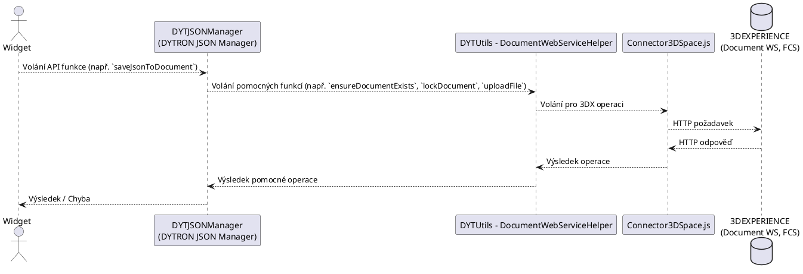

---
**Název Dokumentu:** Návrh systému - DYTRON JSON Manager
**Datum Vytvoření:** 2025-05-10
**Autor:** KONR
**Verze:** 0.5 (Refaktorované API na vysokoúrovňové funkce, zmínka o pomocné utilitě)
---
<div style="text-align:center; page-break-after:always;">

# Návrh systému

## DYTRON JSON Manager
### (Utilita pro správu JSON dat v dokumentech, zkr. DYTJSONManager)

<br>
<br>
<br>

**Verze:** 0.5

**Datum:** 2025-05-10

**Autor:** KONR

</div>

---
## Obsah

- [Návrh systému](#návrh-systému)
  - [DYTRON JSON Manager](#dytron-json-manager)
    - [(Utilita pro správu JSON dat v dokumentech, zkr. DYTJSONManager)](#utilita-pro-správu-json-dat-v-dokumentech-zkr-dytjsonmanager)
  - [Obsah](#obsah)
  - [1. Úvod](#1-úvod)
    - [1.1. Účel dokumentu](#11-účel-dokumentu)
    - [1.2. Rozsah systému (této utility)](#12-rozsah-systému-této-utility)
    - [1.3. Cíloví uživatelé systému](#13-cíloví-uživatelé-systému)
    - [1.4. Odkazy](#14-odkazy)
  - [2. Celková architektura](#2-celková-architektura)
    - [2.1. Přehled architektury](#21-přehled-architektury)
    - [2.2. Klíčové komponenty](#22-klíčové-komponenty)
    - [2.3. Vztah k pomocné utilitě DocumentWebServiceHelper](#23-vztah-k-pomocné-utilitě-documentwebservicehelper)
  - [3. Návrh rozhraní (API Utility)](#3-návrh-rozhraní-api-utility)
  - [4. Návrh datových struktur (Příklady)](#4-návrh-datových-struktur-příklady)
    - [4.1. DocumentInfo (Příklad objektu)](#41-documentinfo-příklad-objektu)
    - [4.2. FileInfo (Příklad objektu pro metadata souboru)](#42-fileinfo-příklad-objektu-pro-metadata-souboru)
    - [4.3. DownloadedJson (Příklad objektu pro výstup z loadJsonFromDocument)](#43-downloadedjson-příklad-objektu-pro-výstup-z-loadjsonfromdocument)
  - [5. Popis klíčových scénářů](#5-popis-klíčových-scénářů)
    - [5.1. Scénář: Načtení JSON dat z dokumentu](#51-scénář-načtení-json-dat-z-dokumentu)
    - [5.2. Scénář: Uložení JSON dat do dokumentu](#52-scénář-uložení-json-dat-do-dokumentu)
  - [6. Zpracování chyb](#6-zpracování-chyb)
  - [7. Nefunkční požadavky (pro tuto utilitu)](#7-nefunkční-požadavky-pro-tuto-utilitu)
  - [8. Otevřené otázky návrhu (TODO)](#8-otevřené-otázky-návrhu-todo)

---
## 1. Úvod

### 1.1. Účel dokumentu
Tento dokument popisuje návrh systému pro utilitu `DYTRON JSON Manager` (dále jen "Utilita" nebo zkráceně `DYTJSONManager`), která rozšiřuje stávající `DYTUtils` o funkce pro práci s objekty typu "Document" a jejich souborovými přílohami (primárně JSON soubory) v prostředí 3DEXPERIENCE. Cílem je poskytnout widgetům jednoduché a robustní API pro běžné operace s JSON daty v dokumentech.


Tato utilita se zaměřuje na vysokoúrovňové operace čtení a zápisu JSON dat. Pro nízkoúrovňovější operace s dokumenty bude existovat samostatná pomocná utilita (viz sekce 2.3).

### 1.2. Rozsah systému (této utility)
Systém zahrnuje:
-   API vrstvu Utility, která bude volána Widgety.
-   Interní logiku Utility pro orchestraci volání na 3DEXPERIENCE platformu (primárně skrze pomocnou utilitu a `Connector3DSpace.js`).
-   Interakci s existující komponentou `Connector3DSpace.js` pro veškerou komunikaci s 3DEXPERIENCE.
-   Interakci s Document Web Services a File Collaboration Server (FCS) platformy 3DEXPERIENCE (nepřímo, skrze pomocnou utilitu).

### 1.3. Cíloví uživatelé systému
Primárním aktérem (uživatelem API Utility) je **Widget**.

### 1.4. Odkazy
-   Funkční požadavky: `\\3dexpprod\webapps\DYTUtils\webapps\DYTUtils\Docs\requirements\functional\`
-   Nefunkční požadavky: `\\3dexpprod\webapps\DYTUtils\webapps\DYTUtils\Docs\requirements\non-functional\`
-   OpenAPI specifikace Document Web Services (poskytnuto dříve)

## 2. Celková architektura

### 2.1. Přehled architektury
Utilita bude navržena jako JavaScriptový modul (dle NFR-002[^9], implementace jako RequireJS modul), který bude poskytovat sadu vysokoúrovňových funkcí pro Widgety. Veškerá komunikace s platformou 3DEXPERIENCE bude zapouzdřena a bude probíhat výhradně přes existující modul `Connector3DSpace.js` (dle NFR-001[^8]), přičemž tato utilita bude pro většinu operací využívat pomocnou utilitu `DYTUtils - DocumentWebServiceHelper`.

Utilita bude interně implementovat vícekrokové procesy vyžadované Document Web Services, jako je získávání ticketů pro FCS, nahrávání/stahování souborů na/z FCS a následné potvrzování operací vůči Document objektům, a to delegováním těchto úkolů na `DYTUtils - DocumentWebServiceHelper`.

**Základní tok interakce komponent:**

### 2.2. Klíčové komponenty
1.  **DYTJSONManager (Tato Utilita):**
    *   Poskytuje vysokoúrovňové veřejné API (jako DYTRON JSON Manager) pro Widgety (primárně pro čtení/zápis JSON).
    *   Obsahuje logiku pro zpracování požadavků od Widgetů.
    *   Orchestruje volání na pomocnou utilitu `DYTUtils - DocumentWebServiceHelper`.
    *   Zpracovává odpovědi a chyby.

2.  **Connector3DSpace.js (Existující komponenta):**
    *   Zajišťuje nízkoúrovňovou komunikaci s 3DEXPERIENCE WebAPI.
    *   Zpracovává autentizaci, CSRF tokeny, formátování požadavků a odpovědí.
    *   Bude využíván Novou Utilitou pro všechna volání na Document Web Services a FCS.

3.  **3DEXPERIENCE Platforma:**
    *   **Document Web Services:** Poskytují REST API pro CRUD operace s "Document" objekty a jejich metadaty, včetně získávání ticketů pro FCS.
    *   **File Collaboration Server (FCS):** Zajišťuje fyzické ukládání a stahování souborů.

### 2.3. Vztah k pomocné utilitě DocumentWebServiceHelper
Pro zajištění čistého API této utility (`DYTJSONManager`) a zároveň pro poskytnutí granulárnějších operací pro pokročilé použití bude vytvořena samostatná utilita v rámci projektu `DYTUtils`, nazvaná například `DYTUtils - DocumentWebServiceHelper`.

Tato `DocumentWebServiceHelper` utilita bude obsahovat funkce, které přímo mapují na jednotlivé kroky interakce s Document Web Services (např. vytvoření dokumentu, zamčení/odemčení, smazání souboru, vyhledání dokumentu, nahrání/stažení souboru na/z FCS). Bude zodpovědná za implementaci jednotlivých funkčních požadavků (`[^FR-001]` až `[^FR-007]`).

`DYTJSONManager` bude interně využívat `DocumentWebServiceHelper` k provedení potřebných kroků.
## 3. Návrh rozhraní (API Utility)

Tato utilita bude poskytovat následující dvě klíčové vysokoúrovňové funkce:

*   `loadJsonFromDocument(documentTitle: string, fileName: string): Promise<DownloadedJson | null>`
    *   **Účel:** Načte a deserializuje JSON obsah ze zadaného souboru v dokumentu identifikovaném jeho názvem.
    *   **Vstup:**
        *   `documentTitle`: Název 3DEXPERIENCE "Document" objektu.
        *   `fileName`: Název souboru (např. "data.json") v rámci dokumentu.
    *   **Výstup:** Promise, která resolvuje na objekt `DownloadedJson` (viz 4.3) obsahující deserializovaná JSON data. V případě, že dokument či soubor neexistuje, nebo soubor neobsahuje validní JSON, bude Promise rejectována s chybou.

    *   **Interní kroky (koncepčně, s využitím `DocumentWebServiceHelper`):**
        1.  Zajištění existence dokumentu podle `documentTitle` a získání jeho `docId` (využitím funkcí implementujících `[^FR-001]`, `[^FR-007]` z `DocumentWebServiceHelper`).
        2.  Stažení obsahu souboru `fileName` z dokumentu s `docId` (využitím funkce implementující `[^FR-003]` z `DocumentWebServiceHelper`).
        3.  Deserializace obsahu jako JSON.

*   `saveJsonToDocument(documentTitle: string, fileName: string, jsonData: object | string): Promise<FileInfo>`
    *   **Účel:** Serializuje a uloží daný JSON objekt jako soubor do dokumentu identifikovaného jeho názvem. Pokud soubor již existuje, bude přepsán.
    *   **Vstup:**
        *   `documentTitle`: Název 3DEXPERIENCE "Document" objektu.
        *   `fileName`: Název souboru (např. "config.json"), pod kterým budou data uložena.
        *   `jsonData`: JavaScriptový objekt nebo řetězec JSON, který má být uložen.
    *   **Výstup:** Promise, která resolvuje na objekt `FileInfo` (viz 4.2) popisující nově nahraný soubor. V případě chyby bude Promise rejectována.
    *   **Interní kroky (koncepčně, s využitím `DocumentWebServiceHelper`):**
        1.  Zajištění existence dokumentu podle `documentTitle` a získání jeho `docId` (využitím funkcí implementujících `[^FR-001]`, `[^FR-007]` z `DocumentWebServiceHelper`).
        2.  Zamčení dokumentu (využitím funkce implementující `[^FR-004]` z `DocumentWebServiceHelper`).
        3.  Smazání existujícího souboru se stejným `fileName` (pokud existuje) (využitím funkce implementující `[^FR-005]` z `DocumentWebServiceHelper`).
        4.  Serializace `jsonData` na řetězec (pokud je to objekt).
        5.  Nahrání nového souboru s obsahem JSON (využitím funkce implementující `[^FR-002]` z `DocumentWebServiceHelper`).
        6.  Odemčení dokumentu (využitím funkce implementující `[^FR-006]` z `DocumentWebServiceHelper`).

*Poznámka: Detailní signatury funkcí, návratové typy a chybové stavy budou dále specifikovány.*

## 4. Návrh datových struktur (Příklady)

Tyto datové struktury jsou příklady objektů, které mohou být vráceny z API nebo interně použity.

### 4.1. DocumentInfo (Příklad objektu)
```javascript
// Příklad objektu, který by mohl být vrácen pomocnou utilitou DocumentWebServiceHelper
// a interně použit touto utilitou.
{
  id: "string", // ID dokumentu
  type: "Document", // Typ objektu
  dataelements: {
    title: "string", // Titulek dokumentu
    name: "string" // Technický název (může být autonamed)
    // ... další relevantní metadata vrácená API
  }
  // ... další struktury jako cestamp, relateddata (pokud relevantní pro výstup)
}
```
### 4.2. FileInfo (Příklad objektu pro metadata souboru)
```javascript
// Příklad objektu, který by mohl být vrácen funkcí `saveJsonToDocument`
{
  id: "string", // fileId
  type: "DOCUMENTS", // Typ souborového objektu
  dataelements: {
    title: "string", // fileName
    format: "application/json", // Formát souboru
    // ... další relevantní metadata jako fileSize, modified, comments
  }
  // ... další struktury
}
```
### 4.3. DownloadedJson (Příklad objektu pro výstup z loadJsonFromDocument)
```javascript
// Příklad objektu, který by mohl být vrácen funkcí `loadJsonFromDocument`
{
  content: { /* ... deserializovaný JSON obsah ... */ },
  fileInfo: { // Metadata o souboru, ze kterého bylo čteno (struktura viz FileInfo 4.2)
    id: "string",
    title: "string",
    // ...
  },
  documentInfo: { // Metadata o dokumentu, ze kterého bylo čteno (struktura viz DocumentInfo 4.1)
    id: "string",
    title: "string",
    // ...
  }
}
```
## 5. Popis klíčových scénářů

### 5.1. Scénář: Načtení JSON dat z dokumentu

1.  **Widget** volá `Utilita.loadJsonFromDocument("MujDokument", "konfigurace.json")`.
2.  **Utilita (`DYTJSONManager`)**:
 1.  Volá `DocumentWebServiceHelper.searchDocumentByTitle("MujDokument")` (implementuje `[^FR-007]`).
    2.  `DocumentWebServiceHelper` vrací pole `DocumentInfo` objektů nebo `null`/prázdné pole.
    3.  Pokud `searchDocumentByTitle` vrátí `null`, prázdné pole, nebo dojde k chybě, Utilita rejectuje Promise s chybou "Dokument 'MujDokument' nenalezen". Jinak vezme první nalezený dokument a získá jeho `docId` a `DocumentInfo`.
    4.  Volá `DocumentWebServiceHelper.downloadFileContentByName(docId_z_kroku_3, "konfigurace.json")` (implementuje `[^FR-003]`).
    5.  `DocumentWebServiceHelper` vrací obsah souboru jako string a `FileInfo`.
    6.  Pokud `downloadFileContentByName` vrátí `null` (soubor nenalezen), Utilita rejectuje Promise s chybou "Soubor 'konfigurace.json' v dokumentu 'MujDokument' nenalezen".
    7.  Utilita parsuje string jako JSON. Pokud parsování selže, Utilita rejectuje Promise s chybou "Obsah souboru není validní JSON".
    8.  Utilita sestaví objekt `DownloadedJson` a vrací jej Widgetu.

### 5.2. Scénář: Uložení JSON dat do dokumentu

1.  **Widget** volá `Utilita.saveJsonToDocument("MujDokument", "novaKonfigurace.json", { key: "value" })`.
2.  **Utilita (`DYTJSONManager`)**:
    1.  Volá `DocumentWebServiceHelper.ensureDocumentExists("MujDokument")` (implementuje `[^FR-001]`, `[^FR-007]`).
    2.  `DocumentWebServiceHelper` vrací `docId`.
    3.  Volá `DocumentWebServiceHelper.lockDocument(docId)` (implementuje `[^FR-004]`).
    4.  Volá `DocumentWebServiceHelper.deleteFileByNameFromDocument(docId, "novaKonfigurace.json")` (implementuje `[^FR-005]`). (Tento krok je pro zajištění nahrazení).
    5.  Serializuje `{ key: "value" }` na JSON string.
    6.  Volá `DocumentWebServiceHelper.uploadFileToDocument(docId, "novaKonfigurace.json", jsonString, "application/json")` (implementuje `[^FR-002]`).
    7.  `DocumentWebServiceHelper` vrací `FileInfo` nahraného souboru.
    8.  Volá `DocumentWebServiceHelper.unlockDocument(docId)` (implementuje `[^FR-006]`).
    9.  Utilita vrací `FileInfo` Widgetu.
    10. V případě chyby v kterémkoli kroku (např. při zamčení, nahrání) se pokusí odemknout dokument a vrátí chybu Widgetu.

## 6. Zpracování chyb
-   Utilita bude zachytávat chyby z `DocumentWebServiceHelper` a `Connector3DSpace.js`.
-   Utilita bude pro chybové objekty primárně využívat (předávat dál) formát chybových objektů poskytovaný knihovnou `Connector3DSpace.js` (přes `DocumentWebServiceHelper`). To zajistí konzistenci v chybovém hlášení.
-   V případě, že dokument nebo soubor není nalezen (např. `DocumentWebServiceHelper` vrátí `null` nebo specifickou chybu pro "not found"), tato utilita (`DYTJSONManager`) bude rejectovat Promise s konkrétní chybovou zprávou (např. "Dokument '{documentTitle}' nenalezen" nebo "Soubor '{fileName}' v dokumentu '{documentTitle}' nenalezen").
-   V případě vícekrokových operací, pokud dojde k chybě uprostřed procesu, utilita (a `DocumentWebServiceHelper`) se pokusí uvést systém do konzistentního stavu (např. odemknout dokument, pokud byl zamčen).

## 7. Nefunkční požadavky (pro tuto utilitu)
Budou dodrženy všechny definované nefunkční požadavky, zejména:
-   **NFR-001:** Veškerá komunikace přes `Connector3DSpace.js`[^8] (Primárně skrze `DocumentWebServiceHelper`).
-   **NFR-002:** Implementace jako RequireJS modul[^9].
-   **NFR-003:** Práce s JSON daty[^10].

## 8. Otevřené otázky návrhu (TODO)
-   **[ROZHODNUTO] Detailní návrh chybových objektů/kódů pro tuto utilitu:**
    -   Chybové objekty budou primárně převzaty z `Connector3DSpace.js` (skrze `DocumentWebServiceHelper`).
-   **[ČÁSTEČNĚ ROZHODNUTO] Přesné signatury API funkcí Utility (včetně detailů Promise<T>):**
    -   `loadJsonFromDocument` vrací `Promise<DownloadedJson>` (rejectuje při nenalezení).
    -   `saveJsonToDocument` vrací `Promise<FileInfo>`. Parametr `comment` se nepoužívá.
-   **[ROZHODNUTO] Návrh API a implementace pomocné utility `DYTUtils - DocumentWebServiceHelper`:**
    -   Návrh pro `DYTUtils - DocumentWebServiceHelper` je definován v samostatném dokumentu: `\\3dexpprod\webapps\DYTUtils\webapps\DYTUtils\Docs\navrh_document_webservice_helper.md`.
-   **[ROZHODNUTO] Jak přesně budou řešeny situace, kdy dokument nebo soubor neexistuje:**
    -   Pokud `Connector3DSpace.js` nebo `DocumentWebServiceHelper` indikuje, že dokument/soubor nebyl nalezen (např. vrácením `null` nebo prázdného pole), `DYTJSONManager` bude rejectovat Promise s konkrétní chybovou zprávou (např. "Dokument nenalezen", "Soubor nenalezen").
-   **[ROZHODNUTO] Ověření detailů implementace jednotlivých `FR-xxx` v rámci `DocumentWebServiceHelper`:**
    -   Pro `FR-004` (zamčení dokumentu) se nepoužívá `reservedComment`.
    -   `FR-005` (mazání), `FR-006` (odemčení) a `FR-007` (vyhledávání) byly ověřeny a jejich použití v `DYTJSONManager` (včetně scénáře načítání, který nyní správně používá `searchDocumentByTitle`) je v souladu s návrhem `DocumentWebServiceHelper`.


---
[^1]: FR-001 - Zajištění existence/Vytvoření nového 3DEXPERIENCE "Document" objektu
[^2]: FR-002 - Nahrání/Aktualizace JSON souboru do "Document" objektu
[^3]: FR-003 - Stažení JSON souboru(ů) z "Document" objektu
[^4]: FR-004 - Zamčení (Rezervace) "Document" objektu pro modifikaci
[^5]: FR-005 - Smazání souboru z "Document" objektu
[^6]: FR-006 - Odemčení (Uvolnění rezervace) "Document" objektu
[^7]: FR-007 - Vyhledání "Document" objektu podle názvu
[^8]: NFR-001 - Veškerá komunikace přes Connector3DSpace.js
[^9]: NFR-002 - Implementace jako RequireJS modul
[^10]: NFR-003 - Práce s JSON daty
